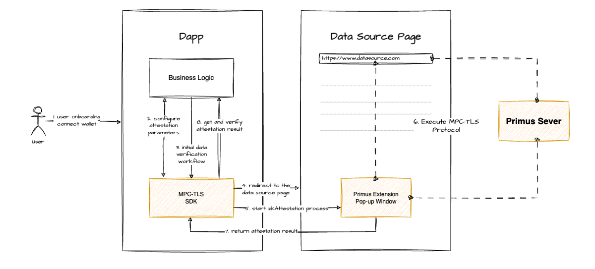

# Primus 工作流程

数据源页面需要使用 [Primus Extension](https://chromewebstore.google.com/detail/pado/oeiomhmbaapihbilkfkhmlajkeegnjhe) 来完成 MPC-TLS 流程。使用 MPC-TLS SDK 时，请在您的 dApp 中提示用户安装最新版本（0.3.15 以上）的 Extension，因为这是必需的。

1. **用户入职**：用户加入您的 dApp，连接他们的钱包，并按照您的指示启动数据证明流程。

2. **配置数据验证参数**：在开始证明过程之前，请确保此证明工作流的 SDK 所需的所有参数均已正确配置。

3. **启动数据验证工作流程**：您的 dApp 激活 MPC-TLS SDK，请求 SDK 中配置的数据和证明内容。

4. **重定向到数据源页面**：您的 dApp 将用户重定向到数据源页面。用户登录该网站的账户后，数据源页面的右上角将出现扩展程序弹窗。

5. **启动数据验证流程**：用户需要点击扩展弹窗上的启动按钮，生成认证流程，如果数据源页面需要登录，则用户必须先完成登录，然后才能点击启动按钮。

6. **执行 MPC-TLS 协议**：数据验证过程开始后，MPC-TLS 协议在数据源页面、扩展程序和证明者之间运行，完成隐私保护证明过程。

7. **返回认证结果**： MPC-TLS 认证过程完成后，无论成功与否，扩展程序都会检索结果并将其发送到 MPC-TLS SDK。对于失败的任务，我们提供了几个[错误代码](../err-list/err-list.md)，以帮助您更好地识别和解决问题。

8. **获取并验证证明结果**：您的 dApp 将从 SDK 中检索证明结果并验证 Primus 的签名以确认结果是否值得信赖。

9. **业务逻辑**：你的 dApp 会根据用户从 SDK 获得的证明执行业务逻辑，决定如何使用该证明、是否提交到链上以及如何使用。

