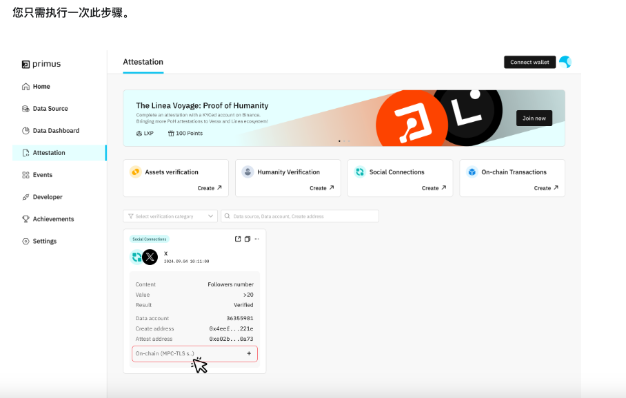

# Primus 使用过程记录

操作电脑: Apple M1 Pro
macOS: 15.1 (24B83)

应用界面的邀请链接添加是否需要有个入口.


## 1

疑问：
MPC-TLS SDK
    - 概述中 - 请将此SDK与一组 MPC-TLS API 一起使用。 MPC-TLS API是什么

Quick Start

这个地方都点怪不知道想表达什么



操作流程：

### 1.打开终端并运行以下命令

```
mkdir pd_test
cd pd_test
```

### 2.初始化项目：

```
npm init -y
```
### 3.安装 SDK

```
npm install --save @padolabs/mpctls-js-sdk
```

[https://github.com/primus-labs/mpctls-js-sdk?tab=readme-ov-file](https://github.com/primus-labs/mpctls-js-sdk?tab=readme-ov-file)

readme 里面的 [Overview](https://docs.padolabs.org/mpc-tls/mpc-tls-sdk/overview) 和 [Quick Start](https://docs.padolabs.org/mpc-tls/mpc-tls-sdk/quickstart) 链接失效

应该改成 [Overview](https://docs.primuslabs.xyz/data-verification/mpc-tls-sdk/overview) 和 [Quick Strat](https://docs.primuslabs.xyz/data-verification/mpc-tls-sdk/quickstart)


### 4.在项目中创建一个 index.js 文件，粘贴：

```
import MPCTLSJSSDK from "@padolabs/mpctls-js-sdk";

const sdkInstance = new MPCTLSJSSDK();

try {
  const initAttestaionResult = await sdkInstance.initAttestation("yourdAppSymbol");
  console.log(initAttestaionResult); //Output: 0.3.15
} catch (e) {
  alert(`Initialize failed,code: ${e.code} ,message: ${e.message}`);
}
```

### 5.配置 package.json

确保 package.json 中有以下配置：

```
{
  "type": "module"
}
```

### 6.运行代码

```
node index.js
```

按照流程配置完以后终端输出为：

```
(base) Echo@EchodeMacBook-Pro pd_test % node index.js
Debugger attached.
333-sdk-process.env.NODE_ENV undefined
Waiting for the debugger to disconnect...
file:///Users/wuxinyang/Desktop/contract/pd_test/index.js:3
const sdkInstance = new MPCTLSJSSDK();
                    ^

TypeError: MPCTLSJSSDK is not a constructor
    at file:///Users/wuxinyang/Desktop/contract/pd_test/index.js:3:21
    at ModuleJob.run (node:internal/modules/esm/module_job:217:25)
    at async ModuleLoader.import (node:internal/modules/esm/loader:316:24)
    at async loadESM (node:internal/process/esm_loader:34:7)
    at async handleMainPromise (node:internal/modules/run_main:66:12)

Node.js v20.9.0
```

## 2
- Setp 2. set up a dAppSymbol (string) of your dApp where to set     


## 3

The parameters should be configured in the following order:

chainID (must)
walletAddress (must)
attestationTypeID (must)
attestationParameters (must, according to different attestationTypeID)


怎么设置


